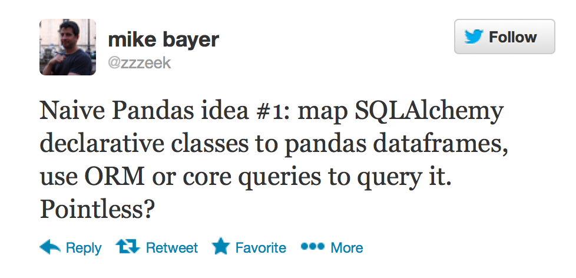
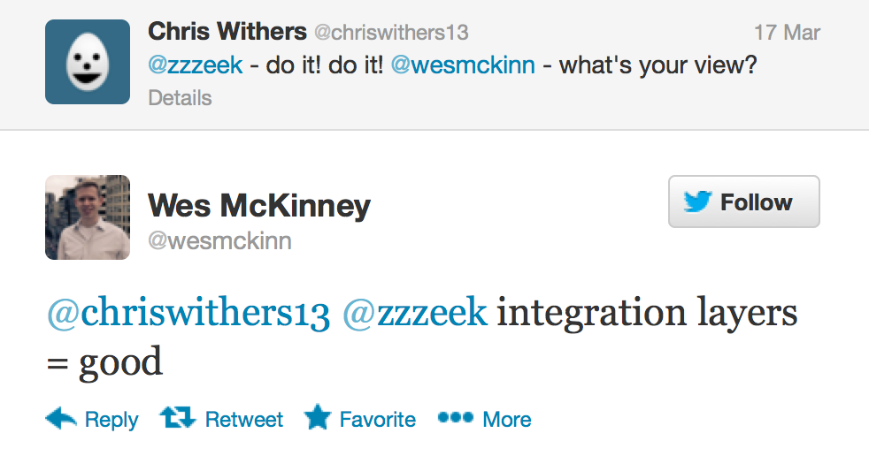

============================================
Crouching Alchemist Hidden Panda (CALCHIPAN)
============================================

What is it?
===========

A `SQLAlchemy <http://www.sqlalchemy.org/>`_ dialect which will
consider a series of `Pandas <pandas.pydata.org/>`_ DataFrame objects
as relational database tables.

Why is it?
==========

Start with this tweet:

Which led to this:

From the man himself, and a Pycon sprint project was born!

